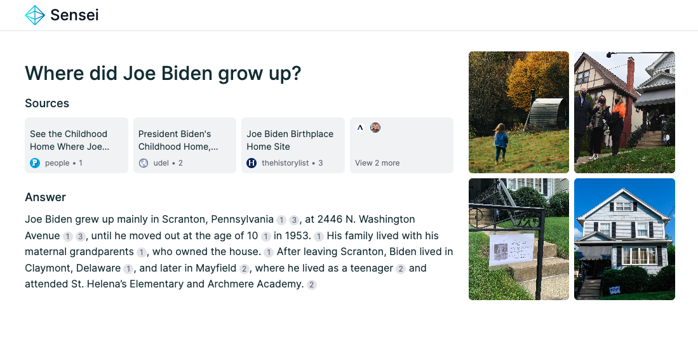
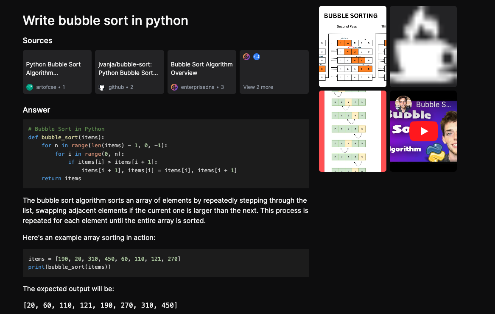

# Sensei Search

Sensei Search is an AI-powered tool designed to deliver the relevant search results.

## 🎥 Demo
http://sensei-frontend.default.52.24.120.109.sslip.io/

## 📸 Screenshots


### Light Mode
<div align="center">
  
</div>

### Dark Mode
<div align="center">
  
</div>


## 📌 Latest Updates
- 06/21/2024 - Add a button to copy code blocks
- 06/19/2024 - Sharable link of search history

## Insights from Utilizing Open Source LLMs

The key takeaways and experiences of working with open source Large Language Models are summarized in a detailed discussion. For more information, you can read the full discussion on Reddit:

- [Building an Open Source Perplexity AI with Open Source LLMs - Reddit Post](https://www.reddit.com/r/LocalLLaMA/comments/1dj7mkq/building_an_open_source_perplexity_ai_with_open/)

## 🛠️ Tech Stack
Sensei Search is built using the following technologies:

- Frontend: Next.js, Tailwind CSS
- Backend: FastAPI, OpenAI client
- LLMs: Mistral-7b and Command-R
- Search: SearxNG
- Memory: Redis
- Deployment: AWS, [Paka](https://github.com/jjleng/paka)

## 🏃‍♂️ How to Run Sensei Search

You can run Sensei Search either locally on your machine or in the cloud.

### Running Locally

Follow these steps to run Sensei Search locally:

1. Prepare the backend environment:
    ```bash
    cd sensei_root_folder/backend/
    mv .env.development.example .env.development
    ```
    Edit `.env.development` as needed. The example environment assumes you run models through Ollama. Make sure you have reasonably good GPUs to run the command-r model.

2. No need to do anything for the frontend.

3. Run the app with the following command:
    ```bash
    cd sensei_root_folder/
    docker compose up
    ```

4. Open your browser and go to [http://localhost:3000](http://localhost:3000)

### Running in the Cloud

We deploy the app to AWS using [paka](https://github.com/jjleng/paka). Please note that the models require GPU instances to run.

Before you start, make sure you have:

- An AWS account
- Requested GPU quota in your AWS account

The configuration for the cluster is located in the `cluster.yaml` file. You'll need to replace the `HF_TOKEN` value in `cluster.yaml` with your own Hugging Face token. This is necessary because the `mistral-7b` and `command-r` models require your account to have accepted their terms and conditions.

Follow these steps to run Sensei Search in the cloud:

1. Install paka:
    ```bash
    pip install paka
    ```

2. Provision the cluster in AWS:
    ```bash
    make provision-prod
    ```

3. Deploy the backend:
    ```bash
    make deploy-backend
    ```

4. Deploy the frontend:
    ```bash
    make deploy-frontend
    ```

5. Get the URL of the frontend:
    ```bash
    paka function list
    ```

6. Open the URL in your browser.
